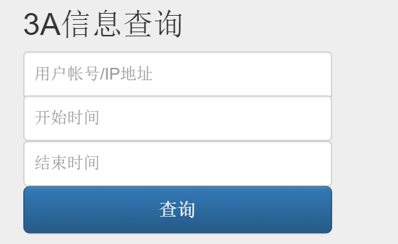
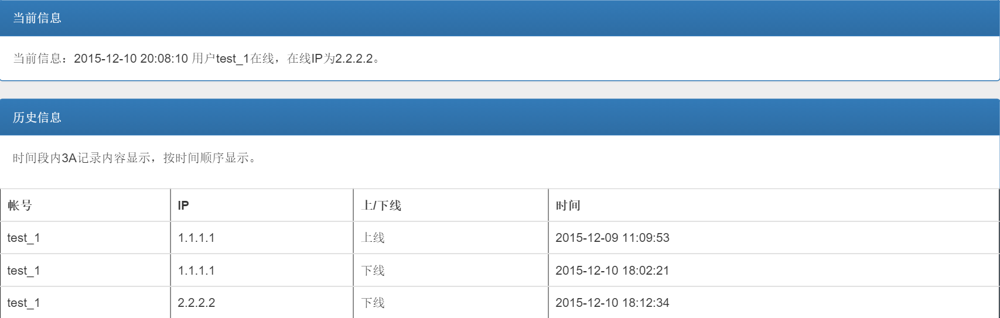

= 绿网用户3A溯源留存系统
Doc Writer <liyafeng@greatbit.com>
:doctype: book
:source-highlighter: coderay
:listing-caption: Listing

== 按IP查询
* 输入内容：IP 开始时间 结束时间
* 显示IP当前是否存在上线用户，如存在显示内容：IP 帐号 地区
* 显示IP时间段内3A信息记录
* 按时间排序，显示记录内容：ip 帐号 上/下线 时间

== 按帐号查询
* 输入内容：帐号 开始时间 结束时间
* 显示用户当前是否在线，如在线显示内容：IP 帐号 地区
* 显示该用户帐号时间段内3A信息记录
* 按时间排序，显示记录内容：ip 帐号 上/下线 时间

=== 查询接口

=== 查询结果

